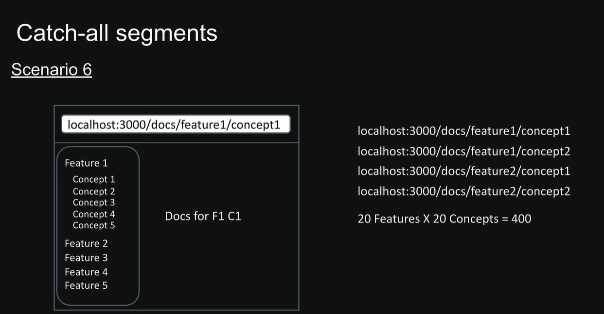
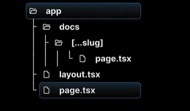
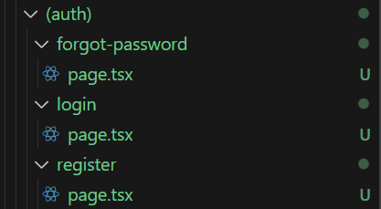
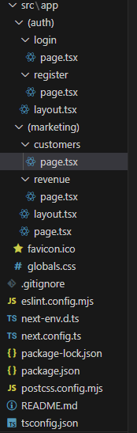
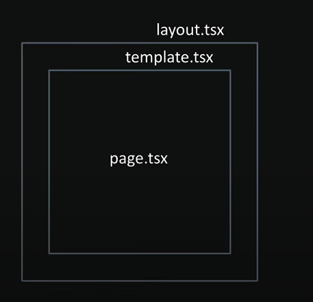

## What is next js

- Next js is a react framework for building fullstack application

## Next.js

- It uses react for building user interface
- Provides additional features that enable you to build production ready applications
- These features include routing, optimized rendering, data fetching, bundling, compiling, and more

## Why learn

- Next.js simplifies the process of building production-ready web applications
- 1. Routing
- 2. API Routes
- 3. Rendering - Supports both client and server routing
- 4. Data fetching
- 5. Styling
- 6. Optimization
- 7. Dev and prod build system

## React Server Component (RSC)

- This architecture introduces a new approach of creating
  React components by dividing them into two distinct types:

  - Server components
    - By Default all components are treated as server components
  - Client components

## Routing conventions

1. All routes must live inside the app folder
2. Route files must be named either page.js or page.jsx
3. Each folder represent a segment of the url path

When this conventions are followed, the file automatically becomes available as a route.

## Dynamic Route

1. In Next.js you can create dynamic routes simply by naming folders or files with square-bracket syntax. The framework will match those segments at request time and hand you the values as “route parameters.”

## Nested Dynamic routes

1.  Next.js (both Pages Router and App Router), you can nest dynamic segments simply by stacking folders (or files) named with square brackets. This lets you capture multiple levels of URL parameters.

## Catch-all segments

### Folder Structure

## Not Found

1. If the given route does not exist then we can define the custom 404 page
   by adding file inside app folder app/not-found.tsx
2. App Router: Add app/not-found.tsx (or segment-scoped not-found.tsx), and use notFound() for programmatic control.

## File Colocation

1. File colocation is simply the practice of “keeping together what belongs together” in your project’s folder structure.
2. In case of Next Js the routes becomes publicly accessible when a `page.tsx` file is added and
   it should be exported as a default component.

## Private Folder

1. A way to tell Next.js. this folder is just for internal stuffs- don't include it in the routing system
2. The folder and all its sub folders are excluded from routing
3. `Add an underscore at the start of the folder name`
4. Private folders are super useful for a bund of things:
   - Keeping the UI logic separate from routing logic
   - Having a consistent way to organize internal files in the project
   - Making it easier to group related files in code editor
   - Avoiding potential naming conflicts with future Next.js file naming conventions
   - If you actually want an underscore in your URL, use `%5F` instead. That's just the
     URL-encoded version of underscore

## Route Group

1.  Let us logically organize our routes and project files without impacting the URL structure.
2.  Implemented authentication routes
    - Register
    - Login
    - Forgot password
3.  To group the routes the parents folder should be within the `()`.\
4.  Folder Structure 
5.  Now the routes can be access directly `example.com/login, example.com/register, example.com/forgot-password` instead of `example.com/auth/login, example.com/auth/register, example.com/auth/forgot-password`

## Layout

1. Pages are route-specific UI components
2. A layout is a UI that is shared between multiple pages in your app

   ### How to create a layout?

   1. `Default export a React component from a layout.js or layout.tsx file`
   2. That component takes a children prop which Next.js will populate with your page content
   3. At root level the layout.tsx or layout.jsx is mandatory

## Nested Layout

1. Nested layouts let you co-locate and compose UI “shells” at any level of your route hierarchy. Each folder in /app can have its own layout.tsx (or .jsx) and those layouts automatically wrap all child routes and layouts beneath them.
2. /app
   - ├── layout.tsx ← root layout (HTML, <body>, global nav, etc.)
   - ├── page.tsx ← renders at “/”
   - ├── dashboard/ ← all routes under “/dashboard”
   - │ ├── layout.tsx ← dashboard-specific shell (sidebar, sub-nav)
   - │ ├── page.tsx ← renders at “/dashboard”
   - │ └── settings/
   - │ ├── layout.tsx ← settings-specific shell (tabs)
   - │ └── page.tsx ← renders at “/dashboard/settings”
   - └── about/
   - └── page.tsx ← “/about”

## Multiple Root layout

1. Makes use of the route group
2. Apply layout selectively to the part of the application
   
3. In the example above the layout for auth is applied only in login and register route and similarly the layout for marketing route is applied only to customer and revenue route.

## Routing Metadata for Search Engine Optimization

1. The metadata AOI in Next.js is a powerful feature that lets us define metadata for each page
2. Metadata ensures out content looks great when its shared or indexed by search engines
3. Two ways to handle metadata in layout.tex or page.tsx files

   - Export a static meta data object
   - Export a dynamic generateMetadata function
   - It is not possible to use static and dynamic metadata in the same segment/page/layout

   ### Configuring Meta data

   1. Both layout.tsx and page.tsx can export metadata. Layout metadata applies to all its pages, while page metadata is specific to that page
   2. Metadata follows a top-down order, starting from the root level
   3. When metadata exist in multiple places along a route, they merge together, with page metadata overriding layout metadata for matching properties
   4. It will `not work in the page that are mark as client directive i.e component marked with use client`

   ### Title field in Metadata

   1. More control
   2. Need to import `Metadata` type from next
      1. It has object that have key as
         1. default - // fallback if no title is provided by a page
         2. template - // `%s - MyWebsite` `%s` will be replaced by the page’s overridden title
         3. absolute - If you need to bypass the template entirely on certain pages, you can pass an absolute title
   3. If you have a root layout.tsx with that descriptor, any nested page can still override just its part

## Link `UI Navigation` `<Link>` component

1. Users
   - click on links
   - get redirected after certain actions
   - `replace` in Link replace the existing page and user will be directed to the root route

## Styling Active Link;

- Based on the link that is current in based on `usePathName` styles can be applied

## Params & Search Params

- `params` is a promise that resolved to an object containing the dynamic route parameters (like id)
- `searchParams` is a promise that resolved to an object containing the query parameters (like filters and sorting)
- While params and search params can be access by making the component async for a client component
  the params and searchParams must be wrapped within the `use` hook of react
- `Note:` While `page.tsx` has access to both `params` and `searchParams`, `layout.tsx` only has access to `params`

## Navigation Programmatically using `"next/navigation"`

- Next js navigation provides with some hooks
  1.  useRouter - User router returns a router and can only be used in the client component, it provides function
      like push, replace, forward, back which can be use to programmatically navigate to the page
  2.  redirect - Can be used to redirect to a certain route

## Template File

1. Create a template by exporting a default React component from a `template.js` or `template.tsx` file
2. Like layout, templated need to accept children prop to render the nested route segments
3. Templates are similar to layout in that they are also UI shared between multiple pages in your app
4. Whenever a user navigates between routes sharing a template, you get a completely fresh start.

   - A new template component instance is mounted
   - DOM elements ar recreated
   - state is cleared
   - effects are re-synchronized

5. Layout and template file can be used together
   
